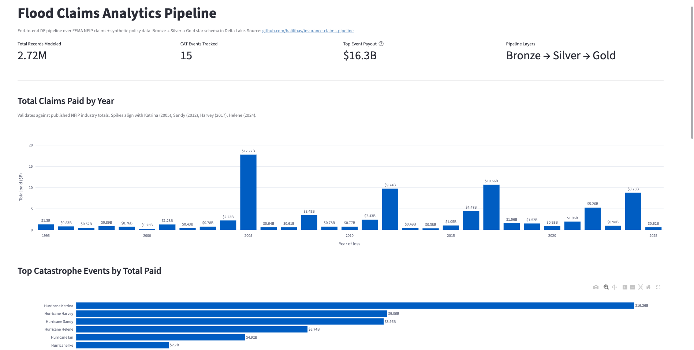
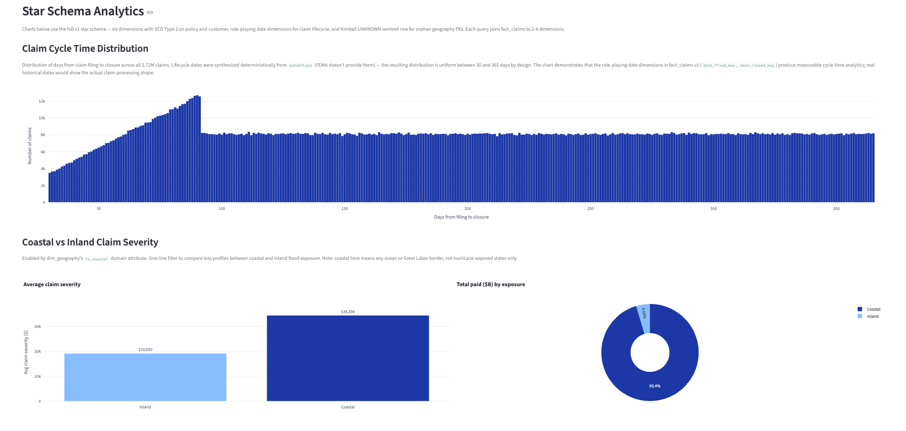
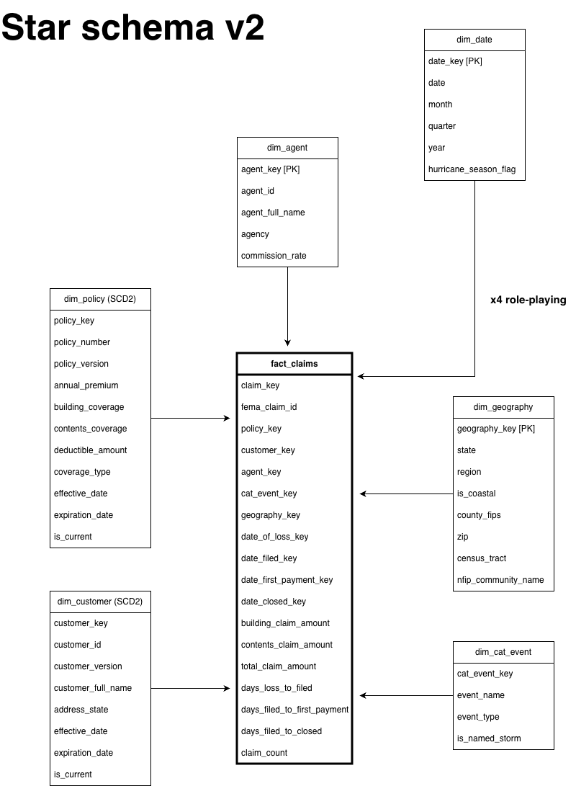
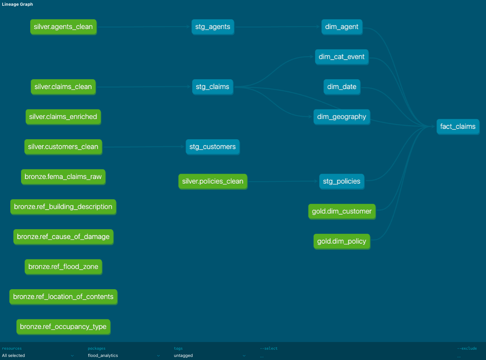
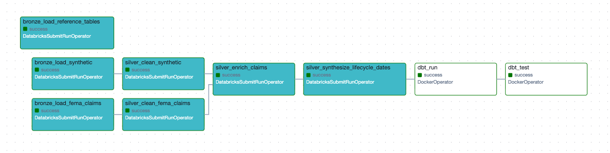

# Flood Claims Analytics Pipeline

> Work in progress - May 2026 - Present

An end-to-end data engineering project using FEMA NFIP flood claims data and synthetic policy, customer, and agent data.

The goal is to build a small but realistic flood analytics pipeline: ingest raw claims data, clean and standardize it through bronze and silver layers, model business-ready tables in a gold layer, and surface claims KPIs in a Streamlit dashboard.


## What's Working 

End-to-end pipeline: FEMA NFIP raw → Bronze Delta → Silver typed/cleaned → Gold star schema → Streamlit dashboard.




**KPI validation** — total payouts by event match published NFIP industry figures within ~5%:

| Event | Project total | Published NFIP | Δ |
|---|---|---|---|
| Hurricane Katrina | $16.26B | ~$16.3B | <1% |
| Hurricane Sandy | $8.96B | ~$8.5B | ~5% |
| Hurricane Harvey | $9.06B | ~$9B | ~1% |

**Star schema depth** — six dimensions, SCD Type 2 on policy and customer, role-playing date dimensions for claim lifecycle:

| Layer | Table | Type | Rows |
|---|---|---|---|
| Bronze | `bronze.fema_claims_raw` | Raw | 2,721,780 |
| Bronze | `bronze.ref_{occupancy_type, cause_of_damage, location_of_contents, building_description, flood_zone}` | Reference | 14 / 12 / 7 / 20 / 12 |
| Silver | `silver.claims_clean` | Cleaned + lifecycle dates | 2,721,780 |
| Gold | `gold.dim_date` | Calendar | 22,280 |
| Gold | `gold.dim_agent` | SCD1 | 75 |
| Gold | `gold.dim_policy` | SCD2 (via Delta MERGE) | 2,721,781 |
| Gold | `gold.dim_customer` | SCD2 (via Delta MERGE) | 2,721,781 |
| Gold | `gold.dim_geography` | SCD1 + Kimball UNKNOWN sentinel | 327,255 |
| Gold | `gold.dim_cat_event` | SCD1 | 192 |
| Gold | `gold.fact_claims` v1 | 10 FKs, cycle time measures | 2,721,780 |

Sanity check: hurricane-season claims average **2.8x higher severity** than off-season — directionally correct for P&C flood.


## Architecture

**Data flow:** External sources → Bronze (Delta) → Silver (Delta) → Gold (dbt marts) → Streamlit

### Data model (v2)



### Pipeline lineage (dbt-managed)

Model dependency graph generated by `dbt docs`. Bronze and silver source data flows through staging views into the gold-layer marts. Note the split between dbt-managed models (teal) and sources (green) — `gold.dim_policy` and `gold.dim_customer` remain PySpark-managed SCD2 dimensions consumed by dbt as sources (see [engineering decisions](docs/decisions.md)).



Full model documentation (columns, tests, upstream/downstream refs) is browsable via `dbt docs serve` locally.

## Orchestration

End-to-end pipeline orchestrated via Apache Airflow running in Docker.



**Canonical DAG:** `medallion_full_refresh` — 9 tasks from raw ingest through validated gold tables.

- **Bronze layer (3 tasks):** FEMA claims, synthetic policies/customers/agents, reference tables
- **Silver layer (4 tasks):** Clean FEMA, clean synthetic, enrich claims, synthesize lifecycle dates
- **Gold layer (2 tasks):** dbt materialize models → dbt test 70+ assertions

**Two orchestration patterns united:**

- `DatabricksSubmitRunOperator` (7 tasks) — PySpark notebooks executed on Databricks Serverless via multi-task Jobs API
- `DockerOperator` (2 tasks) — dbt run and test in an isolated container to avoid dependency conflict between `dbt-databricks` and `apache-airflow-providers-databricks`

**Production realism features:**

- `on_failure_callback` — structured alert payload logged (Slack-webhook-ready in production)
- Per-layer retry tuning: bronze/silver retries 2× with 3 min delay (accommodates Serverless cold-start), dbt retries 1× with 1 min delay (failures are usually deterministic)
- `execution_timeout` per task, `dagrun_timeout` at DAG level (45 min)
- `max_active_tasks=1` to defend against Databricks Free Edition rate limits

**Sub-DAGs available for tactical use:**
- `dbt_refresh` — gold-only rebuild + tests (~2 min)
- `pyspark_bronze_silver` — medallion ingestion only (~10 min)
- `hello_databricks` — smoke test SQL query against gold

**Repository structure for orchestration:**

```
airflow_docker/
├── docker-compose.yaml         # Airflow 2.9.3 + Postgres + Redis + CeleryExecutor
├── dbt.Dockerfile              # Custom image: python:3.11-slim + dbt-databricks
├── dags/
│   ├── hello_databricks.py         # Smoke test
│   ├── dbt_refresh.py              # dbt-only DAG (DockerOperator)
│   ├── pyspark_bronze_silver.py    # PySpark-only DAG (DatabricksSubmitRunOperator)
│   └── medallion_full_refresh.py   # Canonical end-to-end (both operators)
└── .env                        
```

## Stack

Current / planned stack:

- **Compute / storage:** Databricks, Delta Lake
- **Transformation:** PySpark, dbt
- **Orchestration:** Apache Airflow
- **Quality:** dbt tests
- **Visualization:** Streamlit

## Why this domain

I chose flood because the data has enough real-world complexity to make the project useful: claim amounts, dates, locations, catastrophe events, policy attributes, and historical changes.

The project uses flood claims as the example domain, but the engineering patterns are general: raw ingestion, medallion architecture, dimensional modeling, incremental processing, orchestration, testing, and dashboarding.

## Data Sources

- [FEMA NFIP Redacted Claims](https://www.fema.gov/openfema-data-page/fima-nfip-redacted-claims-v2) - public flood claims data
- Synthetic policies, customers, and agents - generated to support policy-level analytics and dimensional modeling

## Business Questions

- How do claim frequency and severity vary by state, flood zone, and property type?
- How do major catastrophe events affect claim volume and paid losses?
- What is the average claim cycle time?
- Which regions or policy segments show unusual claim patterns?
- What is the estimated loss ratio by state or policy segment?