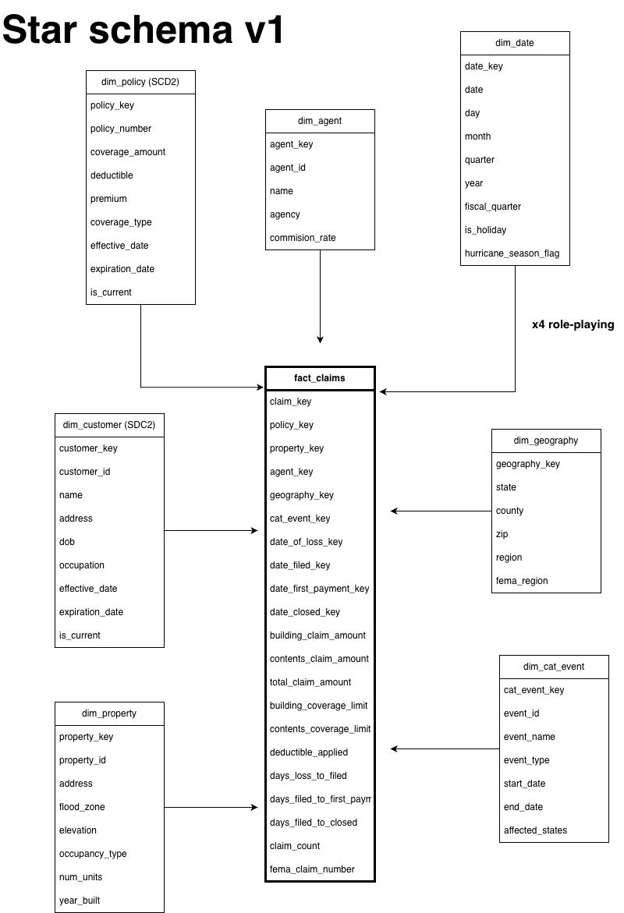

# Data Model — v1

> Diagram: [data_model_v1.png](data_model_v1.png)

## Business process

This data model is the v1 model, focused on the claims lifecycle; future versions will extend to policy administration and premium billing.

## Grain

One row in `fact_claims` represents **one flood claim**, modeled as an accumulating snapshot. Multiple date columns (`date_of_loss_key`, `date_filed_key`, `date_first_payment_key`, `date_closed_key`) track the claim through its lifecycle. As a claim progresses, the corresponding date FKs and measures are updated in place rather than appended as new rows.

I chose accumulating snapshot over transaction grain because FEMA NFIP data is published at the claim-summary level — one record per claim with the full lifecycle reflected — rather than as an event stream. This grain matches the source data structure and supports the analytical questions in scope (claim cycle times, loss ratios, CAT impact).

## Star schema overview

Single fact table at the center (`fact_claims`), seven dimensions arrayed around it. `dim_date` is a role-playing dimension referenced four times via different FKs.

## Fact table

### fact_claims

**Surrogate key:** `claim_key`
**Degenerate dimension:** `fema_claim_number` (FEMA's natural claim ID, retained for traceability)

| Column | Type | Description | Additivity |
|--------|------|-------------|------------|
| building_claim_amount | DECIMAL(12,2) | Paid for building damage | Fully additive |
| contents_claim_amount | DECIMAL(12,2) | Paid for contents damage | Fully additive |
| total_claim_amount | DECIMAL(12,2) | Building + contents | Fully additive |
| building_coverage_limit | DECIMAL(12,2) | From policy at time of loss | Fully additive |
| contents_coverage_limit | DECIMAL(12,2) | From policy at time of loss | Fully additive |
| deductible_applied | DECIMAL(12,2) | Deductible at time of claim | Fully additive |
| days_loss_to_filed | INT | Days from loss event to claim filing | Semi-additive (averageable) |
| days_filed_to_first_payment | INT | Days from filing to first payment | Semi-additive |
| days_filed_to_closed | INT | Days from filing to claim closure | Semi-additive |
| claim_count | INT | Always 1; enables COUNT aggregations | Fully additive |

## Dimension tables

### dim_policy (SCD Type 2)

**Why SCD2:** Premium and coverage parameters change at policy renewal. A claim filed in 2017 must tie to the policy parameters in effect on the date of loss — not today's parameters. Without SCD2, loss-ratio analysis would be incorrect because the "premium earned" denominator would float as policies renewed.

SCD2 is implemented via `effective_date`, `expiration_date`, and `is_current` columns. The `policy_key` surrogate is unique per version of the policy; `policy_number` is the natural key shared across versions.

### dim_customer (SCD Type 2)

**Why SCD2:** Customer address changes are common and matter for geographic claim analysis (a claim's geography should reflect the address at time of loss, not the customer's current address). Same SCD2 mechanics as dim_policy.

### dim_agent (SCD Type 1)

**Why SCD1, not SCD2:** Agent attributes (commission rate, agency assignment) change over time, but historical agent state isn't analytically important for claims analysis at this scope. Overwriting on change keeps the model simpler. If future analysis requires tracking agent productivity over time, this can be upgraded to SCD2.

### dim_property (SCD Type 1, may upgrade in v2)

Started as SCD1 for simplicity. Renovations, elevation changes, and flood-zone reclassifications could justify SCD2 in v2 — parked for now.

### dim_geography (SCD Type 1)

ZIP/county/state hierarchy. Treated as relatively stable; SCD1 is sufficient.

### dim_cat_event (SCD Type 1)

Catastrophe events (Sandy, Harvey, Ian, etc.) curated as a small reference dimension. Claims occurring within the CAT date range and affected states get tagged via `cat_event_key`. Nullable on the fact — non-CAT claims have NULL.

### dim_date (Type 0 — static)

Pre-populated calendar dimension. `date_key` is an integer in YYYYMMDD format (e.g., 20170829 for Hurricane Harvey's landfall). Smart key — sorts naturally, human-readable, fast joins. Referenced four times by `fact_claims` as a role-playing dimension.

## Key design decisions

1. **Star, not snowflake.** Geography attributes are kept flat in `dim_geography` (state, county, ZIP, region all in one row) rather than normalized into separate tables. Kimball-standard for query performance and simplicity.

2. **Surrogate keys throughout.** Every dimension has a warehouse-generated surrogate key separate from its natural/business key. Decouples the analytical model from upstream source changes.

3. **Role-playing dim_date.** One physical date dimension, four logical roles. Stored once, referenced four times via aliased joins. This is preferable to four separate date dimensions.

4. **Degenerate dimension for FEMA claim number.** No useful attributes beyond the ID itself, so it lives in the fact table — Kimball pattern for natural IDs without their own dimension.

5. **CAT event as a dimension, not a fact attribute.** Enables clean filtering ("show me all claims from Hurricane Ian") and supports adding CAT metadata (storm category, NOAA designation, total industry loss estimates) without polluting the fact table.

## Open questions for v2

- Upgrade `dim_property` to SCD2 to track renovations/elevation changes?
- Add `fact_policy_snapshot` (periodic monthly snapshot) for PIF (policies-in-force) analysis?
- Add `dim_coverage_type` as a separate small dimension, or keep as attribute on `dim_policy`?
- Geography granularity: ZIP vs ZIP+4 vs lat/long — depends on what FEMA actually provides
- Add fraud-signal flags as derived facts vs computing on the fly in the gold layer

## Decisions deferred to build time

- Surrogate key generation strategy (identity column vs SHA hash vs UUID)
- Whether to physicalize `total_claim_amount` or compute on read
- Audit column standards (`_ingested_at`, `_source_file`, `_pipeline_run_id`)

## Physical implementation

All tables — bronze, silver, gold — are Delta tables. Storage details:

- **Bronze tables** live in `bronze.*` schema, partitioned by ingest date (`_ingested_at` date portion)
- **Silver tables** live in `silver.*`, partitioned by a natural date attribute (e.g., `silver.claims_clean` partitioned by `loss_year`)
- **Gold tables** live in `gold.*`. Facts partitioned by date dimension (`date_of_loss_key` year portion). Dimensions unpartitioned (small).

**SCD2 implementation:** SCD2 dimensions (`dim_policy`, `dim_customer`) use the standard `effective_date` / `expiration_date` / `is_current` pattern, maintained via Delta `MERGE INTO` operations in the silver-to-gold transformation. The surrogate key (`policy_key`, `customer_key`) is unique per version; the natural key (`policy_number`, `customer_id`) is shared across versions of the same entity.

**Time travel use cases:** Delta time travel will be used for (1) debugging — querying historical state of gold tables when investigating analytical anomalies, (2) reproducibility — re-running KPI calculations against prior versions of the data, (3) audit — answering "what did the data look like at month-end."

## v1 → v2 deltas (post-FEMA exploration)

### Additions to fact_claims (measures)
- `icc_claim_amount` and `icc_coverage_limit` (ICC = Increased Cost of Compliance, FEMA-specific coverage)
- `building_damage_amount` and `contents_damage_amount` (distinct from paid amounts; enables damage-to-payment ratio analysis)
- `water_depth` (event characteristic at this property)
- Net vs gross payment amounts both available; will store gross + add net as derived

### Lifecycle date gap
- FEMA does not provide claim filed, first payment, or closed dates
- Decision: synthesize these from dateOfLoss + plausible offsets to enable cycle-time analytics
- Documented as a known limitation; in a real insurance shop these would come from the claims system

### dim_property expansion
- v1 had 7 attributes; FEMA gives us 20+. Selecting 10-12 high-signal attributes (flood_zone, elevation_difference, occupancy_type, primary_residence_indicator, etc.)
- Adding `flood_zone_current` separately from `flood_zone` to handle FEMA's flood zone remapping over time

### dim_geography enrichment
- Adding: lat/lng, census tract, census block group, NFIP community name and number, CRS classification
- Geographic granularity now property-level coordinates, not just ZIP-level

### dim_cat_event simplification
- FEMA already tags claims with `floodEvent` — derive dim_cat_event from distinct values rather than manually curating + matching by date+state
- Add NOAA event metadata (storm category, dates, total losses) as enrichment in week 6

### New: junk dimension dim_flood_circumstances
- Combines causeOfDamage, floodCharacteristicsIndicator, floodWaterDuration
- Standard Kimball junk-dimension pattern for low-cardinality flag combinations
- Add in v2

### Denial / non-payment analytics
- nonPaymentReasonBuilding / nonPaymentReasonContents enable claim-denial analysis
- Add as fact-level degenerate dimensions or small junk dim

### Degenerate dimensions
- FEMA `id` is the natural row key → `fema_claim_id` in fact_claims
- `ficoNumber` available as a secondary identifier

### Reference tables (new layer)
- ingestion/reference_data/occupancy_type_lookup.csv
- ingestion/reference_data/cause_of_damage_lookup.csv
- ingestion/reference_data/location_of_contents_lookup.csv
- ingestion/reference_data/condominium_coverage_lookup.csv
- Loaded to bronze.ref_* tables and joined in silver to enrich code columns

### dim_geography: drop city, keep lat/long + ZIP + county + census tract
FEMA redacts city to "Currently Unavailable". Granularity available at lat/long is sufficient.

### Bool encoding standardized in silver
All FEMA *Indicator fields cast from 0/1 integer to BOOLEAN at silver layer.